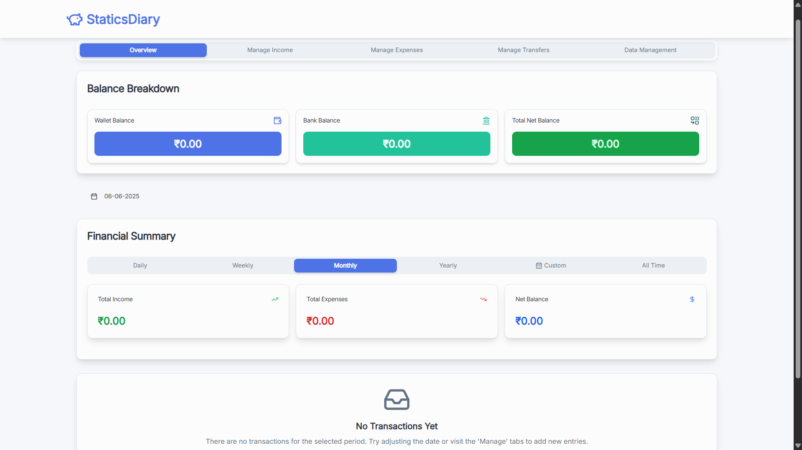

# StaticsDiary - Income & Expense Tracker



PennyWise is a modern, responsive web application designed to help you effortlessly track your daily income, expenses, and transfers. Built with Next.js and a focus on user experience, it provides clear financial insights through intuitive summaries and interactive charts.

## Features

-   **Comprehensive Transaction Tracking:** Easily add, edit, and delete income, expense, and transfer entries.
-   **Multi-Source Balance Management:** Keep track of balances across different sources like Wallet, Bank, and NCMC Card.
-   **Flexible Financial Overviews:** View your financial summary by daily, weekly, monthly, yearly, custom date ranges, or all-time periods.
-   **Interactive Data Visualization:** Gain insights with dynamic pie and bar charts for income sources and expense categories/subcategories.
-   **Data Import & Export:** Securely backup your financial data by exporting it as a JSON file, and restore it by importing a previous backup.
-   **Progressive Web App (PWA) Support:** Install PennyWise to your device for a native app-like experience.
-   **Responsive Design:** Optimized for seamless use across various devices, from desktops to mobile phones.

## Technologies Used

-   **Framework:** Next.js (React)
-   **Language:** TypeScript
-   **Styling:** Tailwind CSS
-   **UI Components:** Shadcn UI
-   **Charting:** Recharts
-   **Date Management:** `date-fns`
-   **Form Management:** React Hook Form
-   **Validation:** Zod
-   **AI Integration (Planned/Minimal):** Genkit AI (currently minimal, but set up for future enhancements)
-   **PWA:** `next-pwa`
-   **State Management:** React Context with `use-local-storage-state` for persistence

## Installation

To get PennyWise up and running on your local machine, follow these steps:

1.  **Clone the repository:**
    ```bash
    git clone https://github.com/JeyaramKumaravel/staticsdiary.git
    cd staticsdiary
    ```

2.  **Install dependencies:**
    ```bash
    npm install
    ```

3.  **Run the development server:**
    ```bash
    npm run dev
    ```
    This will start the Next.js application on `http://localhost:9002`.

4.  **Run the Genkit AI development server (optional, for AI features):**
    ```bash
    npm run genkit:dev
    ```
    This will start the Genkit server, typically on `http://localhost:3400`.

## Usage

Once the application is running, you can:

-   Navigate between the **Overview**, **Income**, **Expenses**, **Transfers**, and **Data** tabs using the navigation bar at the bottom.
-   Use the forms in the **Income**, **Expenses**, and **Transfers** tabs to add new entries.
-   Click on existing transactions to edit or delete them.
-   Explore your financial data through various period summaries and interactive charts on the **Overview** tab.
-   In the **Data** tab, you can export your current data for backup or import a previously saved JSON file.

## Project Structure

-   `src/app/`: Next.js App Router pages and root layout.
-   `src/components/`: Reusable React components, including Shadcn UI components and custom PennyWise specific components (e.g., `pennywise/`, `ncmc/`).
-   `src/contexts/`: React Context API for global state management (e.g., `app-context.tsx`).
-   `src/hooks/`: Custom React hooks for various functionalities (e.g., `use-local-storage-state`, `use-mobile`, `use-toast`).
-   `src/lib/`: Utility functions (e.g., `utils.ts` for date formatting, currency formatting, transaction filtering) and type definitions (`types.ts`).
-   `src/ai/`: Genkit AI related configurations and flows.
-   `public/`: Static assets like icons, manifest file for PWA, and screenshots.

## Screenshots

Additional screenshots are available in the `public/screenshots` directory.

## Contributing

Contributions are welcome! Please feel free to submit a pull request or open an issue.

## License

This project is licensed under the MIT License. See the [LICENSE](LICENSE) file for details. (Note: A `LICENSE` file is not included in the provided context, you may need to create one.)
